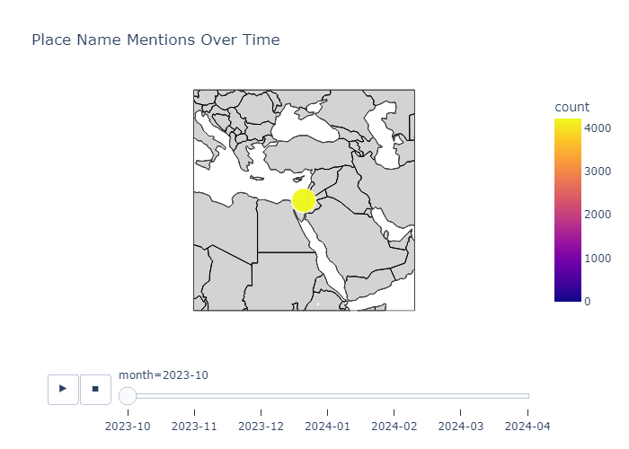

# Mini Project 2

## Project Blurb

This project explores how to visualize the places mentioned in news articles over time. Using computational tools, we extract toponyms (place names), geocode them (retrieve latitude and longitude), and visualize how the geographic scope of the news evolves. We use both regular expressions with a gazetteer and Named Entity Recognition (NER) techniques.

## Folder Structure
```
FASDH25-portfolio2/
|
├── articles/                       #### Collection of news articles
├── AI Documentation/               ### This document includes all the AI helps we took from Chat GPT. It has all the chats with names in it. 
├── gazetteers/                    #### Gazetteer files with place names, which were already in this folder
│   └── geonames_gaza_selection.tsv
├── Data Outputs/                       #### Python scripts used in the project are all saved here in this porject 
│   ├── Frequencies.tsv
│   ├── ner_counts.tsv
│   ├── NER_gazetteer.tsv
│   └── ner_map.html
│   └── ner_map.png
│   ├── regex_counts.tsv
│   └── regex_map.html
│   └── regex_map.png
│
├── Scripts/                       #### All the outputs of the scripts are stored here for more easy access.
│   ├── Gaza_NER2_aqsa_kamran_sarir.ipynb
│   ├── maping_ner.tsv
│   ├── NER_gazetteer.tsv
│   ├── ploting_placenames_4A.tsv
│   └── regex_script_final.tsv
└── README.md                      #### This documentation file is the overall readme where we have mentioned overall progress. 
```

---------------------------------------------

## 2A: Counting place names using Regex

### Overview:

This part focuses on identifying and counting how often specific place names (mainly from Gaza) appear in a collection of news articles using regular expressions.

### Objectives

* Apply regex to identify place names.
* Track their frequency after the Gaza war began on October 7, 2023.
* Output results in a TSV file for later use.

### Tools and Libraries

* Python
* `re`, `os`, `pandas`

### Output (example):

```
placename     month     count
Gaza          2023-10   34
Rafah         2023-11   18
Khan Younis   2023-12   22
```

------------------------------------------------------------------------

## 2B: Place Name Extraction using Stanza (NER) from the corpus

### Overview:

This part extracts place names from articles published in January 2024, using the `stanza` Named Entity Recognition (NER) model.

### Environment Setup

* Done in Google Colab
* Installed `stanza`
* Downloaded English model: `stanza.download('en')`

### Corpus and Filtering

* Cloned GitHub repo: `FASDH25-portfolio2`
* Linked path to articles directory
* Filtered files starting with `2024-01`

### Output (example):

```
place           count
Israel          5567
Gaza            5565
Palestine       427
United States   557
Welch           4
```

-----------------------------------------------------

## 3: Creating gazetteer for NER places

### Overview:

In this section, we created a gazetteer which is a table that list place names along with their longitude and lattitde.

### Input Data

* `ner_counts.tsv` from 2B

### Tools and Functions

* Python libraries: `requests`, `time`
* GeoNames API (username: `kamran.abid`)
* Custom `get_coordinates()` function

### Process Summary

1. Read place names from TSV
2. Query GeoNames API for coordinates
3. Assign "NA" if not found
4. Manually corrected missing entries in Excel
5. Saved results in `NER_gazetteer.tsv`

### Output (structure):

```json
[
  {"Place": "Lahore", "Latitude": "31.5497", "Longitude": "74.3436"},
  ...
]
```

-----------------------------------

## 4A: Mapping Mentions, Gaza War (Regex-Based)

### Overview:

This part creates an animated map showing the monthly frequency of Gaza-related place mentions.

### Files Used

* `regex_counts.tsv`
* `geonames_gaza_selection.tsv`

### Code Workflow

* Libraries: `pandas`, `plotly`
* Merged mention data with gazetteer coordinates
* Created animated and still map versions

### Output

* `regex_map.html`: Interactive globe-style map
* `regex_map.png`: Static snapshot

### Notes

1. Place files in correct directories
2. Script runs in local Python, not Colab

---------------------------------------------------------------------------------------------------------------

## 4B: Mapping NER Results

### Overview:

In this part we made a map that is showing the places that we extracted byy using NER, from text in january 2024. 

### Inputs:

* ner_counts.tsv   this file had the list of place bnames 

* NER_gazetteer.tsv    This file had coordinate s

### Process:

1. Merge files on place names.

2. Create a map with dot sizes reflecting mentioneded frequency.

### Output:

* ner_map.html

* ner_map.png

-----------------------------------------------

## Technique Comparison:
### REgex and Gazetteer:
* Adventages: 
- Regex gave us very accurate results if the word list is made weill.
- It is easy to understand how it works and how to change the patterns as well. 
- no need of complex tools or training. there were just simple rules. If you know them well you can do whatever you want. 
- you can make certain types of regex to match any word you want. 

* Disadventages: 
- It does not work well if the location is no in the list, or even a slight spelling mistake can make the result very different. 
- you have to keep updating the list mannually to add new places, which takes time. 
- sometimes it matches the wrong word by mistake. 

### Named Entity Recognition (NER):
* Adventages: 
- NER can find new or unknown places not only the words which are present in the list.
- you don't need to keep a word list, it is automatic and the work load is less in this case.
- It can understand different structures and sentences, and still finds the correct location through its own internal machanism

* Disadventages:
- It may sometimes mis or wrongly label uncommon or local place names specially in less known languages or areas. 
- It is haeder to figure out why it made a mistake.

----------------------------------------------------------------

## Self Critical Analysis:

In this project, we used two methods to pull out information from war-related articles: Regex with a Gazetteer and a NER (Named Entity Recognition) model. Both methods helped us track how locations were mentioned over time using monthly data. While they gave us useful results, we also faced some technical problems.

### Weaknesses:
- When place names were misspelled, shortened, or new names (like small villages or different versions of "Khan Younis") were used, the methods missed them.
- the maps became messy because the tools picked up too many incorrect or repeated locations. This happened because the NER model wasn’t trained well for this kind of data.
- We had limited experience with Python and the libraries, so we faced many technical difficulties. It was hard for us to connect the steps, fix errors, and make the code work smoothly.
### What we could improve if we had more time:
- We learned that Regex was too strict, and NER gave too many useless results. A combination of both methods could have helped. For example, NER could catch many places, and then Regex or a Gazetteer could help clean up the results by removing wrong ones and keeping rare but important places.
- Many place names were missed due to small spelling mistakes. We could have used edit distance algorithms (which find close spellings) to catch those missing names, especially for places written in different languages.
- One problem was that NER results were not connected to the months in the data. Regex results were better at showing which place was mentioned in which month. With more time, we could have tried to link places to the correct time in a more reliable way to better track how things changed over time.

--------------------------------------------------------------------------------------

## Final Map Images:
### 
### 

## Comparing both images: 
### NER Map (Named Entity Recognition)
- Picks up real place names more accurately.
- Shows a broad, global spread of locations.
- Feels smarter — it understands context, not just patterns.
- Fewer mistakes — doesn’t grab random words as locations.
- Needs a bit more setup (libraries like spaCy or similar), but worth it.

### Regex Map
- Includes some incorrect or irrelevant data (false positives).
- Coverage is patchy — some regions dense, others almost empty.
- Just looks for patterns — doesn’t understand meaning.
- May require manual cleanup of wrong or weird matches.
- Easy to implement quickly with basic Python skills.

--------------------------------

The End...

